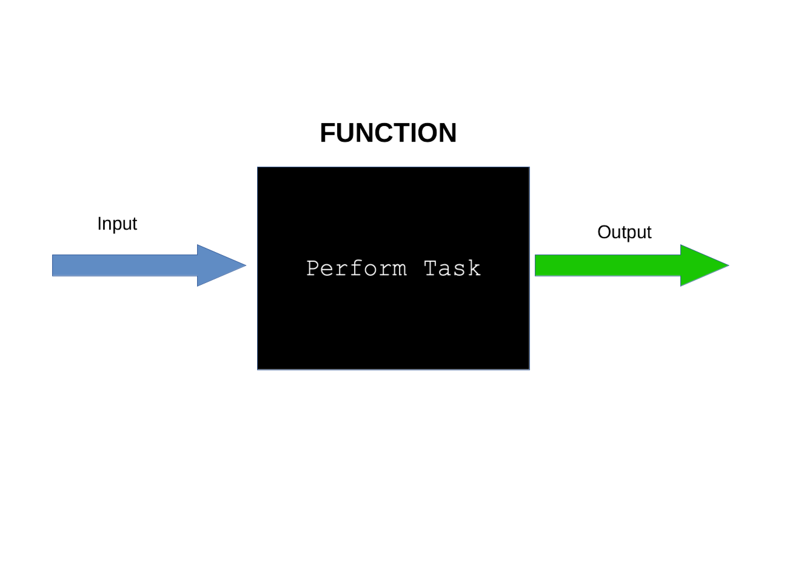
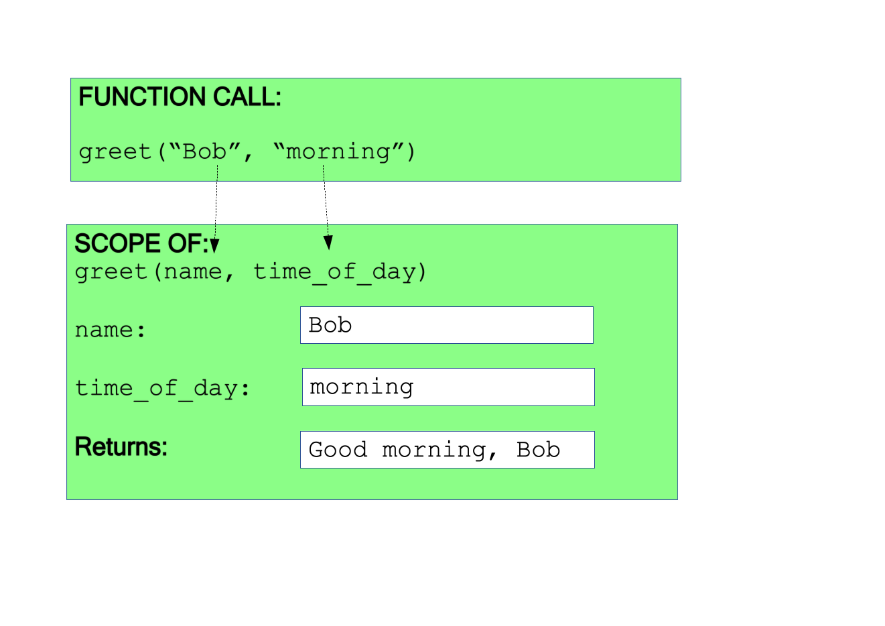
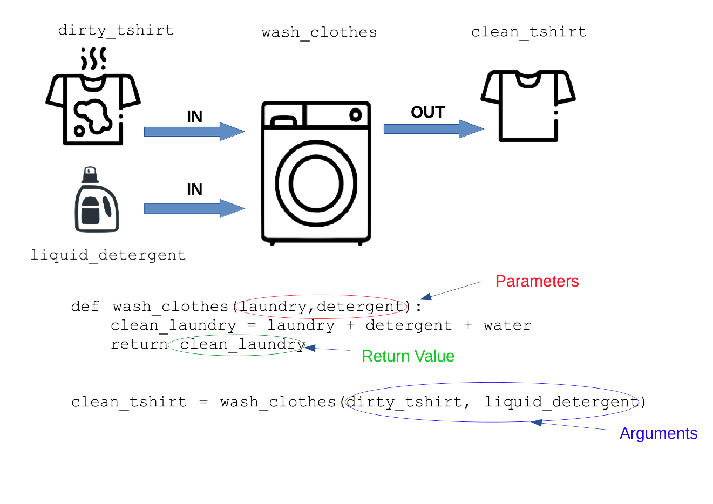

# Functions

### Learning Objectives

- Know what a function is
- Understand why we use functions
- Know how to create a function
- Know how to run the code in a function
- Know how to get a value back from a function
- Understand Parameters & Arguments
- Understand Scope

## What Is a Function?

A 'function' is a reusable chunk of code that can be called (invoked) by name to perform a specific task. We can think of it as a little machine that takes in some information and returns something.



There are two types of function. There are those which simply perform their task and finish - like adding something to a list, and those which perform some logic or calculation and send back the result.

## Why Do We Use Functions?

* Organisation - As our programs get larger if we keep the code all in one place then this can make our code more complicated and difficult . Breaking it up into smaller chunks makes it more manageable and easier to read. It's much easier to find and fix bugs if you've organised your program well.
* Re-usability - One of the principles of writing good code is "Don't Repeat Yourself", or "DRY". When we write functions we can use the code again and again without having to copy and paste the code so this helps use write more DRY code.
* We can 'abstract' our programs into individual parts. When using these individual parts, we only have to concern ourselves with the name of the function, what any inputs are, and what any output is. We do not need to know what goes on inside the function.
* We can 'encapsulate' data so that no other part of the program can interfere with it

## Creating a function

Let's create a little code file to play with.

```bash
# terminal
touch my_functions.py
```

We create a function using the `def`(short for 'define') keyword, then the function name followed by (), and a colon (`:`).

This is followed by the code for what the function actually does. This code is indented so that we can distinguish this code from the rest of the code in the program.

So let's create a really simple function:

```python
# my_functions.py
def greet():
    print("Hey")

```

If we were to run our code now we would get no output. Although we have created a function, the code in the function will not run until we have told the function to run. This is called calling, or invoking a function.

## Calling a Function

To call(or invoke) a function we type the name of the function followed by brackets `()`. The brackets are important because this tells Python that we are calling a function. If we left them out then the Python interpreter would think we are trying to access a variable called `greet`

```python
# my_functions.py
def greet():
    print("Hey")

greet() # ADDED

# => Hey
```

Currently our function is an example of a function which simply completes its task, and finishes. There are often times when we want to get some information back from a function.

## Returning a value from a function

When we want to get something back from a function we use the `return` keyword, followed by whatever we want to get back. So let's change our `greet` function so that, rather than printing the string "Hey" it returns it.

```python
# my_functions.py
def greet():
    return "Hey" # MODIFIED
# => Hey
```

Since we are getting a value back from the function, we can, if we want, assign what we get back to a variable e.g.:

```python
# my_functions.py
def greet():
    return "Hey"

greeting = greet() # MODIFIED
print(greeting)    # ADDED
# => Hey
```

### Returning `None`

But let's say we change our back to the original version, and remove the `return`

```python
# my_functions.py
def greet():
    print("Hey")

greeting = greet() # MODIFIED
print(greeting)    # ADDED
# => Hey
# => None
```

We can see that when we print `greeting` it prints the word `None`. In Python, `None` is a special object which represents the absence of a value, i.e nothing. If a Python function does not hit a `return` statement then, by default, the function will return `None`

## Parameters and Arguments

As well as getting information back from our functions, we can also provide our functions with information that they can work on. This information can affect the behaviour of the function. This is a very important and powerful concept of using functions.

If we want our function to take a piece of information in we need to tell our function that it is going to take in information. We give that piece of information a label, like a variable name and place it in the parenthesis in the function definition. This piece of information that our function takes in is called a __parameter__.

So if we wanted to add a parameter to our `greet` function to take in a person's name we could write:

```python
# my_functions.py

def greet(name): #MODIFIED
  return "Hey " + name

```

We are now saying that, in order to use the 'greet' function, we need to give it some information. If we call the greet function as we do currently

```python
greet()
```

Then we will get an error, as we are not providing any information.

When we call the function we provide the information we want to give to the function inside the brackets `()`. So if we wanted to call the `greet()` function, giving it the name 'Bob' we would write:

```python
# my_functions.py

def greet(name): #MODIFIED
  return "Hey " + name

greeting = greet("Bob")
print(greeting)

# => Hey Bob
```

When we give the function information when calling it this is called an __argument__.

So, in summary, a _parameter_ is what a function takes in, and an _argument_ is what is passed to a function when it is called.

## Multiple Paramaters

Our functions can take in more than one parameter (in fact, as many as they need). Multiple parameters are separated with a comma:

```python
# my_functions.py

def greet(name, time_of_day):
  return "Good " + time_of_day + ", " + name


greeting = greet('Bob', 'morning')
print(greeting)
# => "Good morning, Bob"
```





## Passing variables as arguments

So far we have been passing actual string values as arguments to our functions. We can also pass variables as arguments.

```python
# my_functions.py

def greet(name, time_of_day):
  return "Good " + time_of_day + ", " + name

name_1 = "Bob"
time_of_day_1 = "morning"
greeting = greet(name_1, time_of_day_1)
print(greeting)
# => "Good morning, Bob"

name_2 = "Ada"
time_of_day_2 = "afternoon"
greeting = greet(name_2, time_of_day_2)
print(greeting)
# => "Good afternoon, Ada"
```

You will notice that the variable names passed to the function as arguments do not match the name of the parameters which the function takes.

It is really important to note that when passing a variable as an argument to a function, the variable name does _NOT_ have to match the parameter name.

## Scope

A function has it's own internal world and doesn't share it's variables that another function has. We call this little world the _scope_ of the function.

```python
def greet():
  words = "Hey"
  return words

def greet_two():
  return words

print(greet_two())
```

This will throw an error as the `greet_two()` function doesn't know about `words`.

We call variables which are solely defined in a function "local variables". They exist for the life of the function, then are lost. They cannot be seen by any other function.

# A More Complex Example

Let's look at a more complex example. In the example we have a list of chickens and the farmer would like to go through all the chickens, collecting the eggs and getting the total number of eggs collected:

```python
# my_functions.py

chickens = [
  { "name": "Margaret", "age": 2, "eggs": 0 },
  { "name": "Hetty", "age": 1, "eggs": 2 },
  { "name": "Henrietta", "age": 3, "eggs": 1 },
  { "name": "Audrey", "age": 2, "eggs": 0 },
  { "name": "Mabel", "age": 5, "eggs": 1 },
]


total_eggs = 0

for chicken in chickens:
    total_eggs += chicken["eggs"]
    chicken["eggs"] = 0 # eggs have been collected

print(f"{total_eggs} eggs collected")

```

This piece of standalone code loops through a list of dictionaries performing some action on each item in the list.  

But what if we wanted to count the eggs of a different list of chickens from another farm. We could copy and paste the code and change the name of the list being looped over, but this wouldn't be DRY at all.

We can easily make our egg counting loop go inside a function. We should pass in the list, so that if we wanted to count eggs of a different list of chickens from another farm, we can use the same function, just pass in a different list.

We also want to return the string at the end, instead of using `print`:

```python
# my_functions.py

chickens = [
  { "name": "Margaret", "age": 2, "eggs": 0 },
  { "name": "Hetty", "age": 1, "eggs": 2 },
  { "name": "Henrietta", "age": 3, "eggs": 1 },
  { "name": "Audrey", "age": 2, "eggs": 0 },
  { "name": "Mabel", "age": 5, "eggs": 1 },
]

def count_eggs( list ):
    total_eggs = 0

    for bird in list:
        total_eggs += bird["eggs"]
        bird["eggs"] = 0 # eggs have been collected

    return f"{total_eggs} eggs collected"

print(count_eggs(chickens))
```

## Recap

In this lesson we have covered:

- Know what a function is
  + A re-useable chunk of code which can be called by name to perform a task
- Understand why we use functions
  + Organisation
  + Reusability
  + Abstraction
- Creating a function
  + using the `def` keyword
- Running the code in a function
  + calling the function by it's name and using `()` e.g. `greet()`
- Getting a value back from a function
  + using the `return` keyword
- Parameters & Arguments
  + parameter - what a function takes in
  + argument - what is passed to a function when it is called
- Scope
  + a function has it's own internal world and variables declared inside a function cannot be seen by the code outside it.
