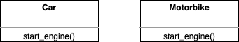
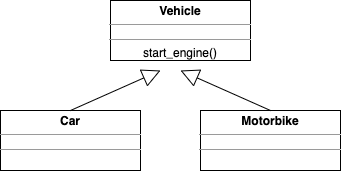
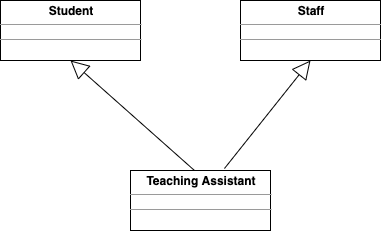
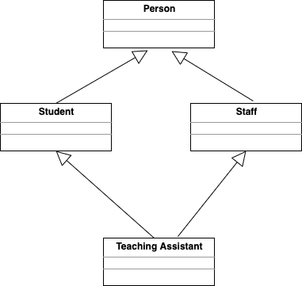

# Inheritance

## Learning Objectives

- Be able to describe inheritance
- Be able to implement a superclass and subclass
- Know how to override methods

Sometimes we might have a bunch of classes that all share some behaviour. For example, a sparrow can fly, but so can a crow.

A car has wheels, but so does a motorbike - they also both help you travel somewhere, and both have an engine that can start.

How can we represent this in our code?

> Hand out start code

```bash
#terminal

touch classes/car.py classes/motorbike.py
code .
```

> Draw class diagram and update it as you go along



```python
# car_test.py
import unittest

from classes.car import Car

class TestCar(unittest.TestCase):

    def setUp(self):
        self.car = Car()

    def test_car_can_start_engine(self):
        self.assertEqual("Vrrmmm", self.car.start_engine())
```

```python
# car.py
class Car:
    def start_engine(self):
        return "Vrrmmm"
```

Now if we want to make a motorbike that also starts its engine what do we do? The simplest solution is that we can copy and paste the code.

> Test Already Exists

```python
# motorbike_test.py
import unittest

from classes.motorbike import Motorbike

class TestMotorbike(unittest.TestCase):

    def setUp(self):
        self.motorbike = Motorbike()

    def test_motorbike_can_start_engine(self):
        self.assertEqual("Vrrmmm", self.motorbike.start_engine())
```

```python
# motorbike.py

class Motorbike:
    def start_engine(self):
        return "Vrrmmm"
```

This is dirty. We want to be able to reuse our code.

If we change this method we need to alter it in two places. We can move this to a "super class" where the behaviour can be shared among the two "sub classes".

```bash
# terminal

touch classes/vehicle.py
```

```python
# run_tests.py

from tests.car_test import TestCar
from tests.motorbike_test import TestMotorbike
from tests.vehicle_test import TestVehicle # ADDED

if __name__ == '__main__':
    unittest.main()
```

```python
# vehicle.py
class Vehicle:
    def start_engine(self):
        return "Vrrmmm"
```

```python
# vehicle_test.py
import unittest

from classes.vehicle import Vehicle

class TestVehicle(unittest.TestCase):

    def setUp(self):
        self.vehicle = Vehicle()

    def test_vehicle_can_start_engine(self):
        self.assertEqual("Vrrmmm", self.vehicle.start_engine())
```

At the moment, we have 3 classes with identical methods. We now want our `Car` and `Motorbike` classes to _inherit_ from the `Vehicle` class. 



Let's start with the `Car` class.

First of all, we need to make the `Vehicle` class available to our `Car` class, using an `import`:

```python
# car.py
from classes.vehicle import Vehicle # ADDED

class Car:
    def start_engine(self):
        return "Vrrmmm"
```

Now we can tell the Python interpreter that our `Car` class inherits from `Vehicle`. We do this by placing the name of the class we want to inherit from in brackets `()` immediately after the class name:

```python
class <SUB_CLASS>(<SUPER_CLASS>):
    # class code
```

```python
# car.py

from classes.vehicle import Vehicle # ADDED

class Car(Vehicle):   # MODIFIED
    def start_engine(self):
        return "Vrrmmm"
```

Since `Car` inherits from `Vehicle` it is going to use the `start_engine` method in `Vehicle` so we can remove the method from the `Car` class

As the class is now empty we'll use the `pass` keyword.

```python
# car.py

from classes.vehicle import Vehicle

class Car(Vehicle):  # MODIFIED
    pass # MODIFIED
```

And we can do the same to our `Motorbike` class:

```python
# motorbike.py

from classes.vehicle import Vehicle # ADDED

class Motorbike(Vehicle):
    pass # MODIFIED
```

Our tests still pass. This is as if the two classes are joined together - the behaviour is passed down to the subclass. This is called "inheriting" properties or behaviours.

Another way to think of the relationship between these classes is that a `Car` __IS_A__ `Vehicle`, and a `Motorbike` also __IS_A__ vehicle. Inheritance is what we use to implement an __IS_A__ relationship between classes

> Perhaps use another example from the real world e.g animals - e.g. an eagle is a bird, a bird is an animal etc

## Overriding

If we declare a method with the same name in a subclass that is shared with a parent, we override it.  Python first looks to the class, and then the super class.  Let's change the motorbike so it has specific behaviour.

```python
# motorbike_test.py

import unittest

from classes.motorbike import Motorbike

class TestMotorbike(unittest.TestCase):

    def setUp(self):
        self.motorbike = Motorbike()

    def test_motorbike_can_start_engine(self):
        self.assertEqual("Vrrmmm (I'm a motorbike), HELL YEAH!", self.motorbike.start_engine()) # MODIFIED
```

```python
# motorbike.py
from vehicle import Vehicle

class Motorbike(Vehicle):
    def start_engine(self):
        return "Vrrmmm (I'm a motorbike), HELL YEAH!" # MODIFIED
```

## Multiple Inheritance

Unlike most other OO languages, Python allows for a class inheriting from one or more classes.



This can lead to increased complexity, especially if 
more than one parent class contains the same method (i.e. which do we use) or even more complicated, if more than one parent classes inherit from the same class, the 'Diamond Problem'



## The Problem with inheritance...

This inheritance stuff seems pretty useful. However if we use it too much it can sometimes be limiting, or make us write our code in a convoluted way. For example, imagine we want to make a Bicycle class. Surely this should inherit from Vehicle - it does transport people around, and it does have wheels. However it doesn't have an engine, so inheriting a start_engine method is a bit of a problem.. what are some solutions?

- Overwrite the start_engine to just return 'I don't have an engine'
- Remove start_engine from vehicle and put it back on Car and Motorbike
- Add another layer of inheritance to have 'EnginedVehicles' and 'HumanPoweredVehicles'

... all of these are a bit nasty. This is where we come onto composition as an alternative way of structuring our programs.
