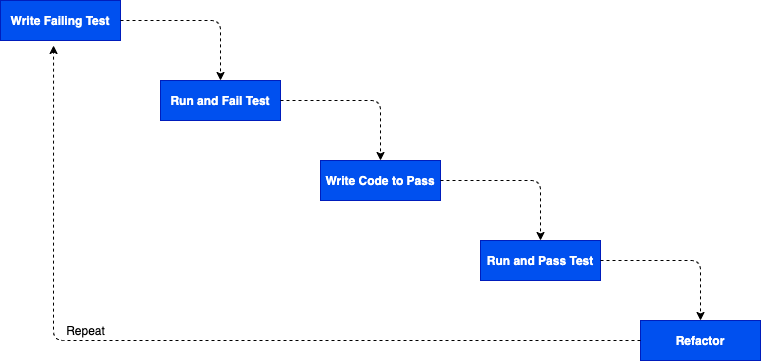

# Test Driven Development

### Learning Objectives

- Know what a test is.
- Know what TDD is.
- Understand the benefits of writing tests first
- Be able to write unit tests, and make them pass

## What is a Test?

Tests can be thought of in a few ways
- a piece of code that verifies that our application is working correctly
- an example that proves our application works as expected

e.g.

``` python
def test_one_plus_one(self):
    expected_value = 2
    actual_value = 1 + 1
    self.assertEqual(expected_value, actual_value)

```

## What Is This Test Verifying?

This test verifies that Python's `+` operator works as we expect it to. In the real world we know `1 + 1 == 2`, and that test verifies that Python works like the real world. i.e., using the example of `1 + 1 = 2` we check that our code meets expectations.

We wouldn't normally need a test for code we didn't write (in part because we
assume the developers who wrote Python have tested it themselves) but it can
be helpful as an example.

## What Does It Mean to "Test-drive" Development?

TDD stands for Test-Driven Development.

At its simplest, it is just writing tests first, then making them pass.

If we want to be a bit more precise about it, TDD lets us design our application and think about what functions we need to write, and what effect we want them to have, before we write them.

We do this by writing a test about the function we *wish* we had, even though
we know it (probably) won't pass. So if I want a function that adds one to any
number, I'd start by pretending I already had that function, and write out
how I wanted it to look.

``` python
def test_add_one_5_is_6(self):
    expected_value = 6
    actual_value = add_one(5)
    self.assertEqual(expected_value, actual_value)

```

At this point all we are thinking about is, given a certain input, we expect our function to return a certain value. We don't think about _how_ our function is going to come to that result.

We continue to think about what functions we need, and what effect we want them
to have after each passing test. In theory (and, as you'll hopefully see, in
practice) this leads to a well-designed, easy to read, application.

> You might notice that we've already been doing this for some of the labs/homeworks where we've provided the tests for the functions/classes we would like you to write.

## Why Bother Test-Driving?

Let's say you are asked to write a function called `compare`.
That function will take in two  `int`s and:

- return the string "*first_number* is greater than *second_number*" if the first number is higher than the second (e.g. `compare(3, 1) => "3 is greater than 1"`)
- return the string "*first_number* is less than *second_number*" if the first number is less than the second (e.g. `compare(3, 5) => "3 is less than 5"`)
- return the string "both numbers are equal" if the two numbers are equal(e.g. `compare(10, 10) == "both numbers are equal"`)

## Where Do You Start?

Your instinct is probably to start thinking about using an operator on the input, or writing an `if` statement. That's cool - that's because you're thinking about the solution.

So let's say you do that and you write your code. How do you know if your function works?

Unfortunately, you don't.

Maybe you write some tests after the code's been written, and that gives you
some confidence. But now how do you know your tests are right?

They key point here is you've never seen your tests fail. So you don't know if
they're good tests. More to the point, you don't even know if they work.

And that's the key to test-driven development. We write a test, we watch it fail, and then we make it pass. That way we have confidence in the tests, because we've seen them fail, and then made them pass, and we have confidence in the code because we've got a lot of passing tests that tell us exactly what the code does.

## Okay, You've Convinced Me. How Do I TDD?

So let's go back to that "compare" example. What's the simplest test we could write to start us off?

Something like:

``` python
# compare_test.py
def test_compare_3_1_returns_3_is_greater_than_1(self):
    self.assertEqual("3 is greater than 1", compare(3, 1))

```

This is weird: we don't have a `compare` function, but in our test it looks
like we do.

Oh well, let's run the test and see what happens!

It fails, obviously. But the important part is the error message, which tells us why it failed. As we already knew, the function `compare` didn't exist. So now we can create it!

``` python
# compare.py
def compare():
    pass
```

Well that solves that problem. Shall we run it again?

> repeat the process, failing that test and fixing the error, until...

``` python
# compare.py
def compare(num_1, num_2):
    return f"{num1} is greater than {num2}"
```

The test passes!

So is our application done? Let's look at what we wanted it to do again.

Clearly we're far from done. But all our tests pass. So now? Write another test!

(...repeat until done...)



## Task

Follow the cycle above, writing further tests and getting them to pass until the `compare` function works as designed.


## FAQs

**How do I know what test to write next?**

This is a tough question. Sometimes it can seem random, especially when you
watch someone else doing TDD. Really, it comes down to one question: does
the code do what it's supposed to yet? So, in the `compare` example, once we
knew that `compare(3,5) == "3 is less than 5"` was `true` it made sense to me to start thinking about what `compare(3, 5)` would return. But you might have preferred to look at `compare(99, 1000)` or `compare(100, 12)` or even `compare(196212, 10000)`. As long as you can explain *why* that test makes sense then it's probably a reasonable test.

**How do I know when I've written enough tests?**

The more you test-drive your code, the easier it will be to know when you've written the right amount of tests. As a simple guide, though, if you can't write another failing test, then you're probably done.

**When do I stop writing tests?**

This is related to the above question. Really the best way to know is
when you can't find another failing test to write. Then again, if you rush ahead and write too much code without testing, you might find it hard to write a failing test. That doesn't necessarily mean that your code is well-tested.

For now, try not to worry too much about this. You'll get a feeling for it as you go on.

**Do I always need to write tests?**

You know what? Probably not.

Many developers never write code without writing tests first. But there are also lots of developers who write tests after they write their code. For many developers it feels much more fulfilling to have the constant validation of making tests pass throughout the day.

If you don't like writing tests first, that's okay. Maybe you'll learn to like it or maybe you won't. But keep in mind a lot of employers will ask about testing, and it'll be helpful to have a reasonable knowledge of how to write good tests.
