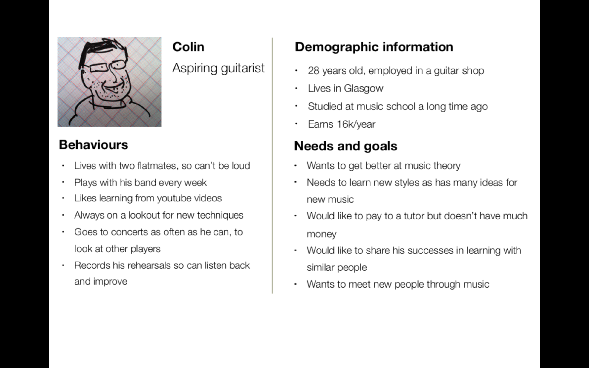

# Proto-Personas

## Learning Objectives

* Know what a proto-persona is
* Know why proto-personas are useful
* Practice creating proto-personas
* Understand that proto-personas should always be used with other UX methods

## Personas vs Proto-personas

### Personas

These are heavily researched representations of your target audience. Generated from data about a current client or user base so more useful for existing products or services.

They are very detailed and have a smooth finish - often used in presentations throughout the UX design process. 

Since they are heavily researched they are both time consuming and expensive.

### Proto-personas

Proto-personas are non-research driven. Instead these are based on our assumptions. They represent what we think our users are like.

Since they are based on assumptions they are less expensive and less time consuming. Good for planning a new project, as it gets everyone on the same page quickly.

### Danger of relying too heavily on personas/proto-personas

It is very easy to create biased and idealised ideas of your users using proto-personas so they must be used in conjunction with other UX research methods.

## Creating a proto-persona

There are four main components to a proto-persona.

1. Who are they? Give them a name and a quick sketch of what they look like
2. Their demographic information. What's their age, education level, etc
3. Their Values and Behaviours. What do they like? What matters to them?
4. Their Needs and Goals. What are they trying to accomplish?

> Talk through example

## Exercise

Now it's your turn to create a proto-persona for your product

In your groups each person should create a proto-persona

> Ask for volunteer to talk through their proto-persona

## Recap

* Proto-personas represent what we think our users are like.
* Proto-personas are quick and rough.
* Proto-personas should be used with other UX design methods.
* Personas are detailed and researched.

