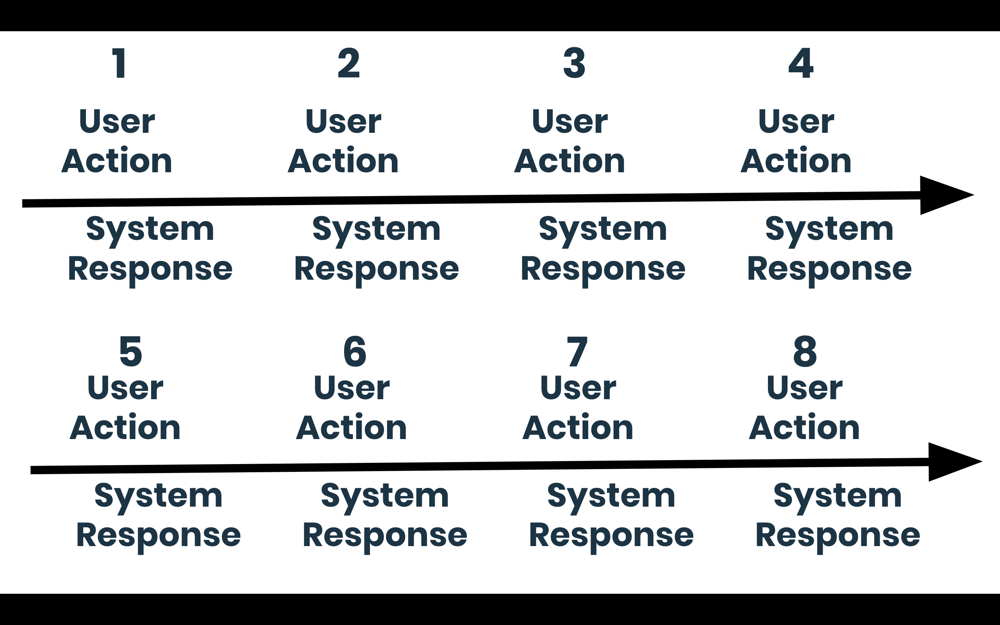

# User Journeys

## Learning Objectives

* Understand the relationship between writing code and the user journey.
* Develop ability to look at the software from the perspective of a user.

## What's a User Journey?

A user journey is a description of steps user takes to achieve a goal and ways the system responds to those steps. Whenever we use applications or websites we're embarking on journeys. We're starting from a having a distinct need (checking the weather, for example) and, after going through a series of steps, we're arriving at a result.

Let's imagine you are planning a camping trip to the Glencoe in the Highlands but you need to check the weather first because you don't want camp in a snowstorm. How would you go about checking the weather?

> Ask students to guide you through the process

User journeys be used in 2 main ways. The first is the way users currently interact with your product or service. The second is the way users could interact with the product/service. We are going to be focusing on the second way as we are going to be building our own projects and we have no current users.

Before you create a user journey you should understand your users needs/goals, the actual behaviours and steps taken by users and what challenges they could face.

## A real User Journey

There is no right or wrong way of diagramming a user journey but here is the template we are going to use will take this format.

Each user action will have a corresponding system response. For example a user journey for someone using an ATM could be:

> Talk through the ATM example.

## Exercise

Now it is your turn to draw a user journey for your product. Think about all the actions a user will have to take to complete their end goal and all the system responses that they might receive.

> Get a volunteer to show and discuss their user journey.

## Recap

*
