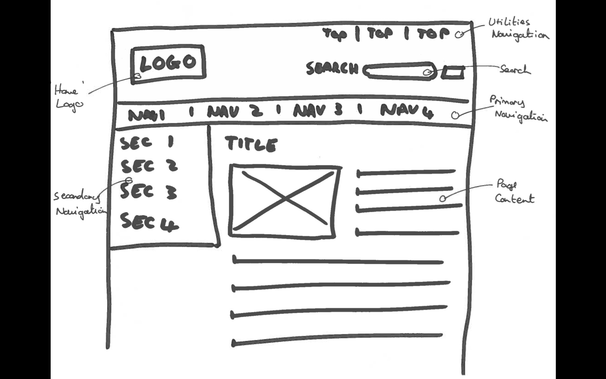
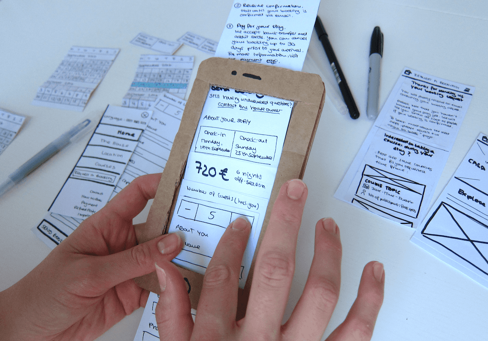

# Wireframing and Prototyping

## Learning Objectives

* To grasp at the concept of prototyping and understand the neccessity of it.
* To understand basic difference between sketches, wireframes and prototypes.
* To acquire basic skills required for paper prototyping.
* To get an awareness of wireframing and prototyping software

##What are Wireframes and Prototypes?

### Wireframes

Wireframes and prototypes are representations of the system created before it is built to share and clarify vision. 

Wireframes usually come first, they are the drawn lo-fi representation of what the website or product will look like using simple shapes. They help communicate how the pages will be put together and which elements they will use. 

There are many software packages and websites that can help you create wireframes but hand drawn ones are acceptable as well. 

### Prototypes

Prototypes are essentially clickable wireframes that allow participants in testing to embark on the user journey. Prototypes can be as simple as pieces of paper that you physically swapped out for other pieces. Or they can be made in responsive html. 

As fun as it is to cut and stick pieces of paper for 3 hours, when you have to show off your prototypes to stakeholders and financial backers, this might be the time to use dynamic prototypes. 

## Getting Feedback

Once you make your prototypes, you're not done with them, you need to test them out. Get people involved who have not had a hand in the design process and ask multiple people. 

When you have someone testing your prototype it is important to ask them non leading questions to get useful and actionable feedback. For example if you just ask someone "Do you like it?", they will more than likely just say yes or no. On the other hand if you ask them a more open ended question like "how does it come across to you?", you are more likely to get more than a one word answer. 

## Where to start
1. Make sure that you understand your audience: what are their needs, expectations and habits. 

2. Make a decision on the viewport for prototyping i.e. are you designing for mobile or desktop?

3. Decide what screens you need to sketch out or prototype for the journey. 

4. Note all functionality and interactions on your sketch.

## Exercise

Refering back to your user journeys from earlier, start creating some wireframes of some pages for your app/website. Remember to focus on the functionality and not how visually stunning it is going to be. Since none of us are stakeholders, we are all designers, we are just going to be using pens and paper. 

> Get some volunteers to show off their wireframes. 

## Software 
For your own projects you might want to use software to help you build the wireframes and prototypes if you don't feel like you're the best at drawing or you've done a paper sketch first and want to improve on it.

For static Wireframes you can use tools like:
 
 * Draw.io
 * Sketch
 * Canva

For interactive prototypes:

* Balsamiq 
* UXPin

And there are many more out there, but bare in mind that not all of them will be free but that some might offer free trials. 

## Recap

* Wireframes are fast to create therefore enabling you to focus on functionality.
* Prototypes allow us to build realistic, clickable proof of concepts that allow users and stakeholders to get a feel for what we’re building. 
* Test your prototypes with users and ask non leading open ended questions for useful feedback.