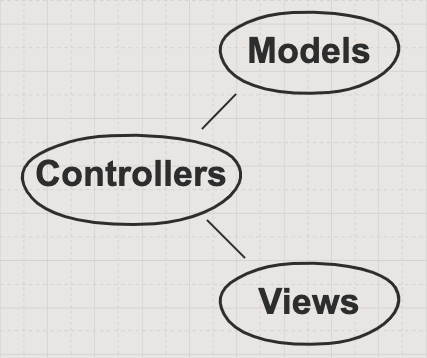
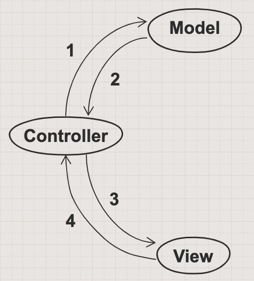
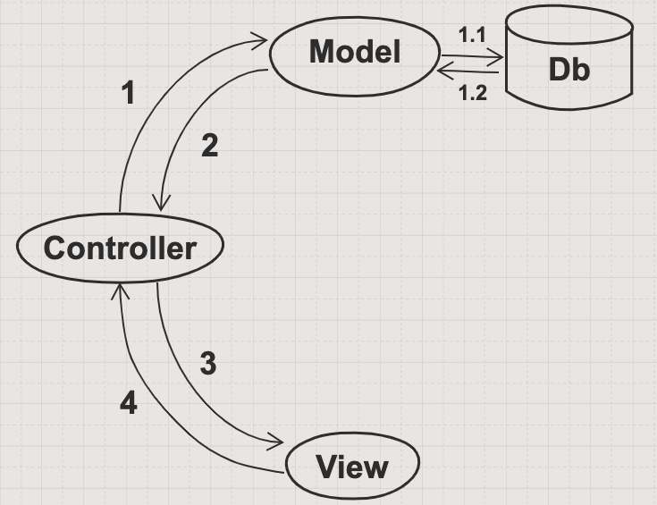

# MVC

## Learning Objectives

- Know that MVC is a commonly used pattern in software development
- Know the role of the models, views and controllers within MVC

##### Duration 20 mins

## Introduction

Last week we began to use Python for web development. We used Python to create a web server which serves HTML web pages to clients. As the web apps that we create become larger and more complex, the code becomes increasingly difficult to organise. Large, complex codebases that are disorganised are much harder to enhance and maintain. Adding a simple new feature might take much longer and debugging can become much more difficult.

Last week we built some web pages and servers which handled the routing of clients to the correct web pages. This week we will add another layer to our web apps - data. This will significantly increase the scope of what our apps are able to do, but it will also increase the complexity of our apps; meaning that we should take extra care when designing them.

Enter MVC. MVC is one of the most widely used patterns in web development. It will help us to keep our codebase well organised as the complexity increases. Before we delve to deeply into what MVC is, or how it will help us, let's make sure that we understand the problems that MVC will solve.

## Design Concerns

- **We must keep our business logic separate from our user interface.** If we want to change the interface, we should not have to also change the actual logic of the app.

- **We want to reuse our code when possible.** We know that if we model a Bus, Busstop or Passenger once, we can make as many busses, busstops and passengers as we want. Similarly, if we can build a web page once, we should be able to reuse that web page to display any data. (e.g. You don't write a blog by writing multiple pages, you write a single blog page and populate it with different text for each post)

- **We want our apps to remember data between runs.** Right now we run our apps, they do their thing, and then they're done! There is no way of storing data, or reading back data that has been stored. This is probably fine for Terminal apps, but makes no sense for web apps. We don't want to have to make a new Bus, Busstop and Passenger every time we log in to our bus system!

When we are dealing with web apps, there are many ways we can structure the code.  In the past, there have been many ways to do this e.g. the flat structure of PHP or the front end - back end code files of ASP.NET which tie a given piece of C# to a front end html file. The problem with these patterns is that they often result in clunky, long code files and messy html littered with logic. To address this problem, MVC came along.

## The MVC Pattern

MVC stands for Model, View, Controller, which refers to very abstract terms for the three components of an MVC app:

- **Models** - the business logic behind the app, the actual functionality of it.
- **Views** - the bits of the app that a user actually sees and can interact with.
- **Controllers** - responsible for binding the functionality of models to the users' interactions with views.

The good news is that you already know how to build an app's models. This is just a fancy term for classes and functions, and you've been building and testing Python classes and functions for three weeks now. You've got this covered.

They are called models because not every language uses the word "class" here. Python does, and so does Ruby, but JavaScript calls them prototypes. Some languages give us other types of models, for example Java has not only classes but interfaces, enums... But we're getting ahead of ourselves. For now, "models" is just a general term for classes.

You can also build an app's views already. Since we are targeting the web, the app's views are just going to be simple HTML and CSS, as you've built on the pre-course (there will be a refresher!). We have only one trick to add, and that is to inject Python code _straight into_ our HTML and CSS.

And that just leaves the controller. And really this is so much more simple than you might think. Using a Python framework called Flask, we're able to run a web server and give it instructions like, "When a user does _that_, get _this_ data and put it _here_."

## Flow

With MVC, 
- the client inputs a url which is picked up by our application and handled by a Controller. 
- The controller is responsible for deciding what to do when a given 'route' is matched (a route being a pairing of a path '/cats' and sometimes an HTTP verb such as 'GET' or 'POST' ). 
- Next, the controller may create / fetch whichever Model it needs to bundle up the data / logic which is necessary for the page to be rendered. 
- Lastly, this Model is passed to a View where the model is accessed to render the information to the page.

### Example

To give a concrete example, check out the world famous [Random Kitten Generator](http://www.randomkittengenerator.com/). This simple app has the following flow:

1. When the page is loaded, the app's **controller** makes a call to the Kitten image **model** for the URL to a random kitten image.
2. The URL is passed back to the **controller**, 
3. The URL is injected into an HTML `` tag's `src` attribute inside the app's **view**.
4. When the user clicks on the image in the **view**, an event is triggered in the **controller** that fetches another random image URL from the **model**, and the cycle repeats itself.

## The data

The only question then, is where does the random kitten image come from? Well, maybe the developers just have a huge list of image URLs hard-coded into their app. But if they're sensible, they have these URLs stored in a database, and they query this database whenever they need a random kitten.

This is what we covered last week when we had our SQL database and wrote Python classes and repositories which interacted with the database.

This week we will build the controller and views that will round out our web app. Hold on to your butts!

