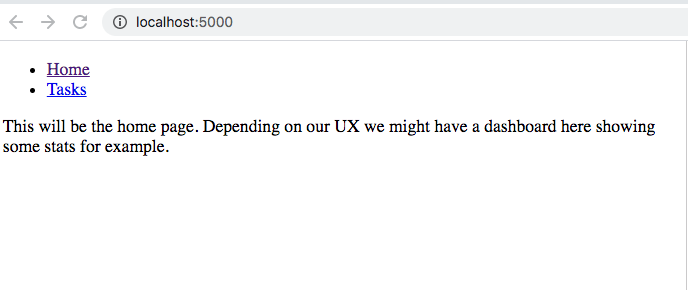
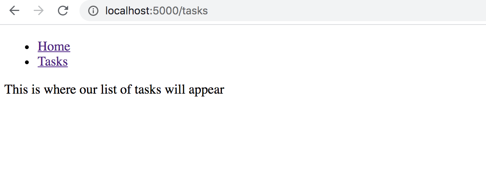
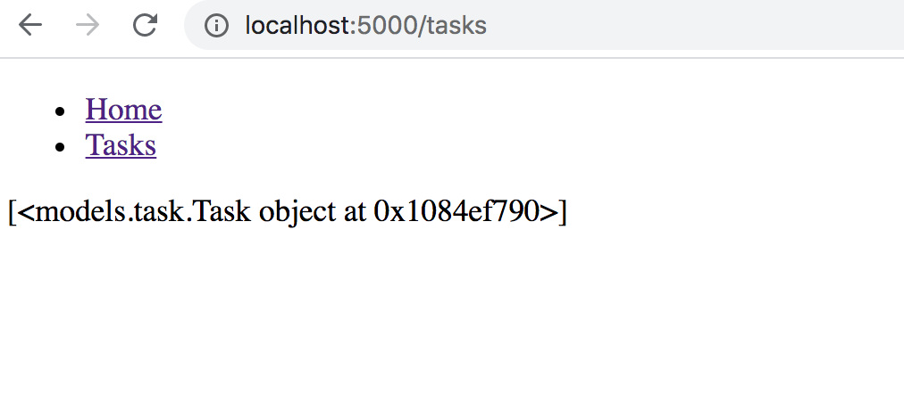
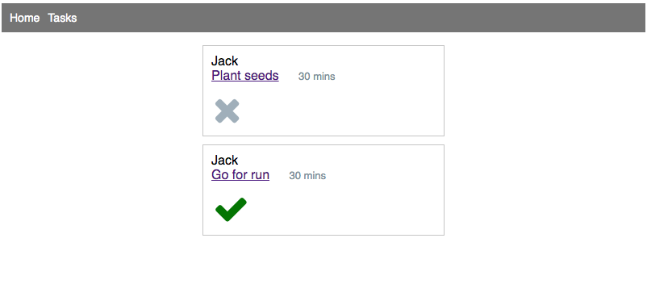

# Full Stack 'Task List' App

#### Objectives

* Understand how the models interact with the server
* Know how to set up a web server for our models

We're going to walk through creating a Task List app to build upon the work we've already done.
We've completed the models and persistence (database) layer of the application.

Now we need to hook up Flask to provide a web interface. Users will be able to list all the tasks, create tasks, and edit or delete tasks.   


## Project Structure

Rename the `start_point` to `task_list` and cd into it.

We'll assume we're working from this directory from now on. The file names at the top of each code block are relative to this directory.

Here's our directory structure:

```

├── task_list/
│   ├── app.py
│   ├── controllers/
│   ├── db/
│   ├── models/
│   ├── repositories/
│   ├── templates/
│   └── static/
└── tests/
│   ├── task_test.py
```


## Step 1: Getting up and running

First thing we want to do is get a simple Flask app up and running. We'll add some comments to explain what each line does and then add the code.

Let's run the script.

```bash
flask run
```

Browse to `localhost:5000` and we have our home page Step 1 up and running! We are running the web server and returning HTML to the browser.




## __main__ and debug

In this case, we are running the script directly using the above command. That means the value of __name__ will be '__main__' and `app.run()` will execute. This gives us more control over our script.

We're also passing a debug argument to the run method which means Flask will print out any error messages on the web page.


## Step 2: Adding a `tasks` route

If we click on the tasks link in the menu we'll get a 404 not found response from the server.

This means the route `/tasks` does not exist in our code.

### Separation of concerns

Remember, we often want to separate code into small chunks so that it's responsible for only one or a few things.

In this case, we'll put all of the routes that relate to `tasks` in a controller file called `tasks_controller`.

```bash
mkdir controllers
touch controllers/tasks_controller.py
```

We'll add the code and then talk through it.

```python
# controllers/tasks_controller.py

# Import Flask and render_template
from flask import Flask, render_template

# Import Blueprint class from flask
from flask import Blueprint

# Create a new instance of Blueprint called "tasks"
tasks_blueprint = Blueprint("tasks", __name__)

# Declare a route for the list of tasks
@tasks_blueprint.route("/tasks")
def tasks():
    return render_template("tasks/index.html")
```

## Blueprints

Blueprints represents a collection of routes and other app-related functions that can be registered on a real application later.

The basic concept of blueprints is that they record operations to execute when registered on an application. Here, we're using a Blueprint to group together routes relating to our `tasks` resource and then registering the blueprint with our flask application.

```python
# app.py

from flask import Flask, render_template

from controllers.tasks_controller import tasks_blueprint # NEW

app = Flask(__name__)

# Register the blueprint with the Flask app
app.register_blueprint(tasks_blueprint) # NEW

```

If we try clicking on the tasks link now we'll raise an error. Let's have a look at it so we can know what do to next.

```
jinja2.exceptions.TemplateNotFound: tasks/index.html
```

So, we don't have an tasks/index.html file. Let's create one an put in some dummy text.

```bash
mkdir templates/tasks
touch templates/tasks/index.html
```

```html
# tasks/index.html



This is where our list of tasks will appear

```




## RESTful Routes

A RESTful route is a route that provides mapping between HTTP verbs (get, post, put, delete, patch) to controller CRUD actions (create, read, update, delete).

Instead of relying solely on the URL to indicate what site to visit, a RESTful route also depends on the HTTP verb and the URL.

So our list of tasks is a `GET request to /tasks`

What are the other routes we'll need to complete our CRUD actions? Let's add them as comments to our controller so we know what we need to do.

```python
# controllers/tasks_controller.py

# RESTful CRUD Routes

# INDEX
# GET '/tasks'

# NEW
# GET '/tasks/new'

# CREATE
# POST '/tasks'

# SHOW
# GET '/tasks/<id>'

# EDIT
# GET '/tasks/<id>/edit'

# UPDATE
# PUT '/tasks/<id>'

# DELETE
# DELETE '/tasks/<id>'
```

## Listing tasks from the database

OK, so now we know what we have to achieve let's look at actually getting dynamic data from the database onto the screen.

In our INDEX route, we're going to ask our Task Repository to select all the tasks from the table and pass them to the index template.

```python
# controllers/tasks
from flask import Flask, render_template
from repositories import task_repository # NEW

# AS BEFORE

@tasks_blueprint.route("/tasks")
def tasks():
    tasks = task_repository.select_all() # NEW
    return render_template("tasks/index.html", all_tasks = tasks) # NEW
```

Now, our templates/tasks/index.html file has access to the all_tasks object which we can loop round and display each task on the page. Let's prove that it's available to us.

```html
# templates/tasks/index.html




{{ all_tasks }} <!-- NEW -->


```



Great, now let's do our loop.

```html
# templates/tasks/index.html





  {{task.description}}



```

Great, we've proved to ourselves that we have our tasks displaying on the screen. Try adding another to the database and see if it turns up on the page.

## Add some CSS

Let's add some CSS to make it a bit more usable. We've already done the CSS for you so let's just add some divs and classnames.

We're also using some icons from <a href="https://fontawesome.com/">Fontawesome</a> for our edit and delete buttons and also to indicate if the task is complete or not.

```html
# templates/tasks/index.html


  <div class="task">
    <div class="content">
      {{task.user.first_name}}
      <div class="description">
        {{task.description}}
        <span class="duration">{{task.duration}} mins</span>
      </div>
      <div class="buttons">
        
          <i class="fa fa-check fa-2x" style="color:green" aria-hidden="true"></i>
        
          <i class="fa fa-times fa-2x" aria-hidden="true"></i>
        
      </div>
    </div>
  </div>

```

We'll add 2 links to the stylesheets.

```html
# templates/base.html

<head>
  <meta charset="UTF-8">
  <meta name="viewport" content="width=device-width, initial-scale=1.0">
  <meta http-equiv="X-UA-Compatible" content="ie=edge">
  <link rel="stylesheet" href="https://stackpath.bootstrapcdn.com/font-awesome/4.7.0/css/font-awesome.min.css" crossorigin="anonymous"> <!-- NEW -->
  <link rel="stylesheet" href="{{ url_for('static', filename='style.css') }}"> <!-- NEW -->
  <title>My Task List</title>
</head>

```




## Summary

Let's recap what we've done.

1. We used a basic start point for a Flask app to get a simple HTML page returned to the browser.

2. Then we added a Blueprint for our tasks controller and added a `/tasks` route.

3. Then we commented in the list of RESTful routes that we need for a CRUD app.

4. Then we used our task_repository object to retrieve all the tasks from the database.

5. Then we looped round them and displayed them on the index template for tasks.

6. Then we added some CSS classes for usability.

In <a href="full_stack_part_2.md">part 2</a> we'll complete the remaining RESTful routes.
