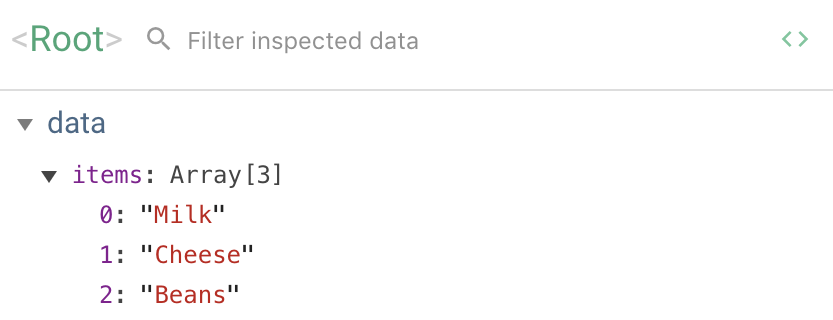

# Vue: Loops and Conditionals

**Duration: 90 minutes**

### Learning Objectives

- Be able to work with Vue's devtools
- Be able to work with Loops and Arrays in Vue
- Be able to work with Conditionals in Vue
- Be able to work with forms and Vue's `v-model` directive
- Be able to implement Vue's `v-bind` directive
- Understand when to implement Vue `modifiers`

## Introduction

We're going to spend the next little while making something a bit more complex in Vue. But before we do, we need to look at our tooling.

One of the drawbacks of two-way binding is that it can be a little difficult to visualise the state of our program; the all-important `data` object.

To help with this, we're going to install [Vue's devtools for Chrome](https://chrome.google.com/webstore/detail/vuejs-devtools/nhdogjmejiglipccpnnnanhbledajbpd).

Once these are installed, we need to change one small setting.

- Right click on the Vue icon in the toolbar, click "Manage Extensions"
- Scroll down and make sure that "Allow access to file URLs" is selected.

We'll see the benefits that this will bring shortly.

## Shopping List

We're going to work through a slightly more complex app in order to see some key Vue concepts. In this lesson, we'll make a shopping list that should:

- Display a list of items
- Allow the user to add new items
- Allow the user to mark items as "purchased"

> Download Start point and open in VS Code then `npm run serve`

Let's start by displaying a simple list of items.

## The v-for directive

When we're planning our app in Vue, we can either start by thinking about the model (what data is stored) - or the view (what is displayed to the user.) Different people will approach problems in different ways, so experiment and find out what works best for you.

For now, we're going to start with the most basic approach of simply displaying a list of items, without worrying about marking items as complete, or adding items.

We know that we're going to need to track a list of items - an array - so let's start by declaring that on our componet. Let's put a couple of items in there to start off.

```js
//App.vue

data() {
  return {
    items: ["Milk", "Cheese", "Beans"] //NEW
  }
},
```

To see this reflected in our app, we can use our newly-installed Vue Devtools and look at the `data` that's present!



> Note: You might need to refresh your page or even restart your browser to see the relevant devtools pane!

To display this list, we need to use the `v-for` directive. If we want one `<ul>` element, and multiple `<li>` elements, one for each item - we can do something like this:

```html
<!-- App.vue -->
<div id="app">
<ul> <!-- NEW -->
  <li v-for="item in items">{{ item }}</li>
</ul>
</div>
```

If we look at our browser now we should see the list! Let's talk through `v-for`.

`v-for` sets up a loop. Of course, we need to loop _over_ something, and in this case, we're looping over the `items` array in the data object. Each individual item can be referred to inside the moustaches as `{{ item }}`. (Because we said `"item in items"`).

We can also access the index of the loop - the position of the item of the array - and this will come in useful later.

Let's go ahead and add a form, to allow us to add new items to our list.

### Adding a form

Once again, we can think about our problem from the model side, or the view side. Let's think about what we want the user to see.

In this case, we probably want to create a form to display a text input field, and a button for the user to click. Let's start there.

```html
<!-- App.vue -->

<ul>
  <li v-for="item in items">{{ item }}</li>
</ul>

<form> <!-- NEW  -->
  <label for="new-item">Add a new item:</label>
  <input id="new-item" type="text" />
  <input type="submit" value ="Save New Item" />
</form>
```

The browser should now show these elements, but they're not doing anything yet. Let's fix that.

## Introducing v-model

In order to capture input from the user, ideally, we want to know the value of the text input at all times. We want to be able to create a _two-way binding_ between the input element and a key / value pair on our `data` object.

We can achieve this by using the `v-model` directive. Let's change our code.

```html
<!-- App.vue -->

<input id="new-item" type="text" v-model="newItem" /> <!-- MODIFIED -->
```

If look at our browser console, we'll see an error here.

>  Property or method "newItem" is not defined on the instance but referenced during render.

To set up our binding, we need to declare the `newItem` key on our `data` object too. Since it should start off being empty, we'll give it the value of an empty string.

```js
//App.vue

data() {
  return {
  items: ["Milk", "Cheese", "Beans"],
  newItem: "" // NEW
  }
},
```

That's all we need to do! Now, whenever the value of the text input changes, the `newItem` variable will be automatically updated. And vice-versa, if we change the variable in our model, our view will change automatically.

If we refresh our browser, we can use devtools to watch our model dynamically update!

Now that we know what the user is typing, we can simply finish the job - we need to ensure that when the form is submitted, we take the value of `newItem` and add it to our `items` array. Before we can do that though, we probably need to remind ourselves about the default behaviour of an html `form` element - let's look what happens if we enter an item into the text input and then click on our form's submit input just now. The item disappears! Why is this?

## Modifiers

Remember, this is because by default a html form, when submitted, sends a post request to the current URL. In vanilla JavaScript, we might handle this problem using `preventDefault()`, like so:

```js
// App.vue

methods{
  handleSubmit: function(event){
    event.preventDefault()
  }
}
```

But to implement this in Vue would be a bit of an anti-pattern - Vue is meant to handle our DOM manipulation for us, so surely there must be something it can provide to mitigate this problem? Thankfully, there is - and it's called a Vue `modifier`. `Modifiers` can be added to our Vue `directives` to add more functionality to them. We'll see a couple of these as we go, but our first one looks something like this:

```html
<!-- App.vue -->

<form v-on:submit.prevent="saveNewItem"> <!-- MODIFIED -->
  <label for="new-item">Add a new item:</label>
  <input id="new-item" type="text" v-model="newItem" />
  <input type="submit" value ="Save New Item" />
</form>

```

Now when we click our button, whatever we've typed in the input is still there. The form is no longer undertaking its default behaviour, so we're not making a post request to the current URL. We will, however, get an error to tell us that our `saveNewItem` method doesn't exist, and that's fair enough - because that's your next task.

### Task: 10 minutes

- create a method - `saveNewItem`
- Inside this method, take the text entered by the user in `this.newItem`, and push it on to the array `this.items`
- After that, set `this.newItem` to be an empty string inside the method. What does this do? Why?

#### Solution:

```js
//App.vue

methods: {
  saveNewItem: function(){ //NEW
    this.items.push(this.newItem);
    this.newItem = "";
  }
}
```

Answer: Setting `this.newItem = "";` clears the text box for the user, ready to enter the next item. This is because two-way binding works... both ways!

## Marking items as complete

In order to mark an item as "purchased", we need to think about the data we store for each individual item. We want to store:

- Its name (as a string, as before)
- Its purchased status (a boolean, `true` or `false`)

How can we achieve this? Instead of storing a string, we'll store an object instead. It might look like this:

```js
{ name: "Milk", isPurchased: true }
```

Let's amend our data object to reflect our new data structure.

```js
//App.vue

data: {
  items: [ //MODIFIED
    {name: "Milk", isPurchased: false},
    {name: "Cheese", isPurchased: true},
    {name: "Beans", isPurchased: false},
  ],
  newItem: ""
},
```

And now that each item is an object, we need to update our template to use the object's `name` property.

```html
<!-- App.vue -->

<li v-for="item in items">{{ item.name }}</li> <!-- MODIFIED -->
```

If we refresh our page, we should at least have a list of items again.

Next, we need to display something to show the user that the item has been purchased. For now, let's just add a span element if the object's `isPurchased` field is true.

To do this, we need to use Vue's `v-if` directive.

```html
<!-- App.vue -->

<li v-for="item in items">
  <span>{{ item.name }}</span>
  <span v-if="item.isPurchased">Purchased!</span> <!-- NEW -->
</li>
```

`v-if` will output the span element **only** if `item.isPurchased` evaluates to `true`. Otherwise, it won't.

We have two tasks remaining.

- Allow the user to create new objects again, and
- Allow the user to mark items as "purchased"

Let's deal with the first one first, as it's broken at the moment.

### Creating objects

Let's look at the method we created earlier to add an item to the `this.items`.

```js
//App.vue

saveNewItem: function(){
  this.items.push(this.newItem);
  this.newItem = "";
}
```

At the moment, it's simply pushing a string onto the array. We need to change this, so that it pushes an object with a `name` and `purchased` status instead.

```js
//App.vue

saveNewItem: function(){
  this.items.push({ //MODIFIED
    name: this.newItem,
    isPurchased: false
  });
  this.newItem = "";
}
```

With this small change, we should be able to add items again.

### Allowing the user to mark items as purchased

Our last job is to let the user mark items as purchased.

Let's add a button to each element that _isn't_ currently marked as purchased. To do this, we can use a negated `v-if`. We only want to display the button if `isPurchased` is `false`.

```html
<!-- App.vue -->

<li v-for="item in items">
  <span>{{ item.name }}</span>
  <span v-if="item.isPurchased">Purchased!</span>>
  <button v-if="!item.isPurchased">Purchase</button> <!-- NEW -->
</li>
```

So if the item is purchased, we display a span element saying "Purchased!". Otherwise, we display a button allowing the user to purchase the item.

To finish off, we need to add a click handler to the button. To figure out which item should be marked as "purchased", `v-for` allows us to grab the index of the loop, and pass it to our method!

```html
<!-- App.vue -->

<li v-for="(item, index) in items"> <!-- MODIFIED -->
  <span>{{ item.name }}</span>
  <span v-if="item.isPurchased"> - Purchased!</span>
  <button v-if="!item.isPurchased" v-on:click="buyItem(index)">Purchase</button> <!-- MODIFIED -->
</li>
```

### Task - 5 minutes

- Write the method buyItem(index). 

(Remember you will need to comma separate your methods)

#### Solution:

```js
//App.vue

 methods: {
    saveNewItem: function () {
      // AS BEFORE
    },
     buyItem: function(index){
      this.items[index].isPurchased = true;
    }
  }
```

## Getting rid of that pesky `key` error

We are still getting a warning that our v-for requires a key. Let's use the index as the key for each item. 

The reason each element in the list will need a key is so that Vue can update the list more efficiently. 

If we were to update one of the items then Vue can target and render the changes only for that item rather then re-rendering the full list again. 

```html
<!-- App.vue -->
 <li v-for="(item, index) in items" :key="index"> <!-- MODIFIED -->
```

Now if we we look our warning should be gone. 

Let's talk about the `:` at the start of key. 

## Introducing v-bind

Let's say that we wanted to add a class to our `li` - `purchased` if the item has been purchased, `not-purchased` otherwise.

We can use a ternary to achieve this. Let's try it out:

```html
<!-- App.vue -->

<li v-for="(item, index) in items" class="item.isPurchased ? 'purchased':'not-purchased'"> <!-- MODIFIED -->
  <span>{{ item.name }}</span>
  <span v-if="item.isPurchased"> - Purchased!</span>
  <button v-if="!item.isPurchased" v-on:click="buyItem(index)">Purchase</button>
</li>
```

If we look in our devtools, this hasn't quite had the desired effect. Vue has done exactly as we've asked, and set the class as follows: `class="item.isPurchased ? 'purchased':'not-purchased'"`. How can we get around this?

We want to make `class` dynamic; to evaluate a JavaScript expression to decide how to set our HTML attribute.

When we want to use a variable or expression in an HTML attribute, we have to use the `v-bind` directive, as follows:

```html
<!-- App.vue -->

<li v-for="(item, index) in items" v-bind:class="item.isPurchased ? 'purchased':'not-purchased'"> <!-- MODIFIED -->
```

This is such a common pattern that you will often see a shorthand for `v-bind` - simply putting a `:` character before the attribute in question. Like we did with key.

We can simplify what we wrote before:

```html
<!-- App.vue -->
<li v-for="(item, index) in items" :class="item.isPurchased ? 'purchased':'not-purchased'"> <!-- MODIFIED -->
```

We will be using `v-bind` extensively throughout the course in various scenarios.

## Recap

What directive should we use if we want to conditionally output a piece of HTML?
<details>
<summary>Answer</summary>
`v-if`
</details>

What directive should we use if we want to loop through an array and output an HTML element for each item?
<details>
<summary>Answer</summary>
`v-for`
</details>

What is the purpose of `v-model`?
<details>
<summary>Answer</summary>
`v-model` allows us to set up a two-way binding; to capture the entered value from the form as it changes in the UI.

It also allows us to to change the variable in our JavaScript and see the UI dynamically change to represent the new value.
</details>

What is the purpose of `v-bind`?
<details>
<summary>Answer</summary>
`v-bind` allows us to dynamically set HTML attributes to a JavaScript variable, or the result of an expression.
</details>

What are Vue modifiers, and what situation might be they be useful in?
<details>
<summary>Answer</summary>
Vue modifiers are extra functionality that we can use on Vue directives.

For instance, in the case of `v-on:submit.prevent`, the `prevent` stops a form from performing its default behaviour.
</details>

## Conclusion

We've seen how to use `v-if`, `v-for`, `v-model`, `v-bind` and some Vue `modifiers` to construct a simple, dynamic JavaScript application using Vue.

Other form elements work in much the same way - for more information, see Vue's [form guide](https://vuejs.org/v2/guide/forms.html).
