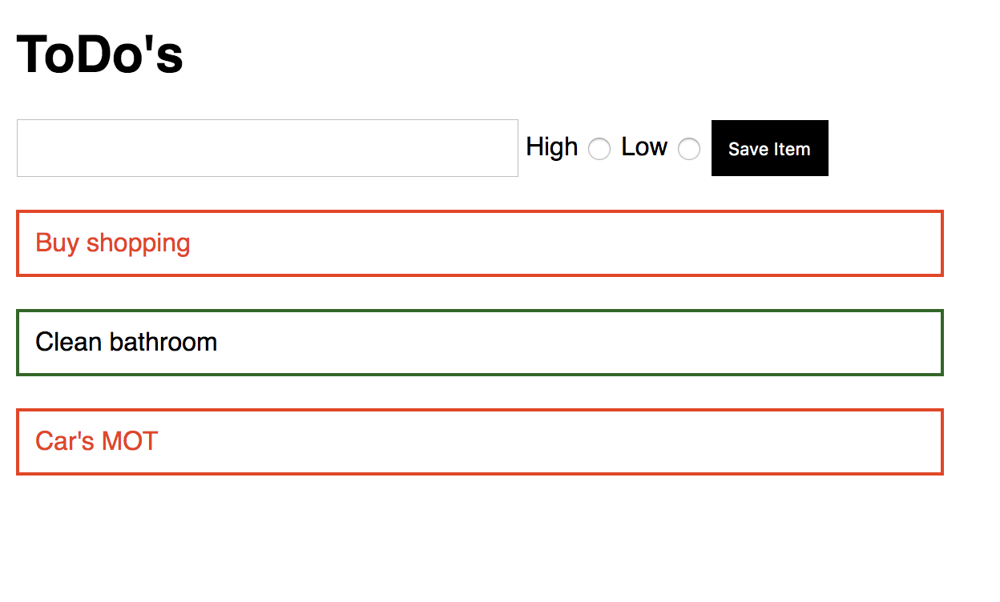

# Homework: ToDo List

## Learning Objectives

- Be able to set up a basic Vue application
- Be able to use forms with `v-model`
- Be able to use `v-on` to manage user events

## Brief

Your task is to create a todo list application that allows a user to save an item to a list which then renders on the page.

Use Vue CLI to build a solution that looks like this:



## MVP

- Render a list of todos from an array of strings.  
- Add the capability to add a new todo to the list.

Your todos array would look something like:
```js
todos: [
  "Buy shopping", "Clean bathroom", "Car's MOT"
]
```

## Extensions

- Update the todos array to take in objects with keys of name and priority.
- Split out each Todo item in the list to it's own component.
- Add radio buttons to track the level of priority.
- Give the user visual feedback on what todos are high priority.

## Setup

1. vue create todo_list.

2. Select Codeclan configuration

3. npm run serve.

4. Go to `http://localhost:8080` and make sure you can see `vue` dev tools.

5. Develop!!
