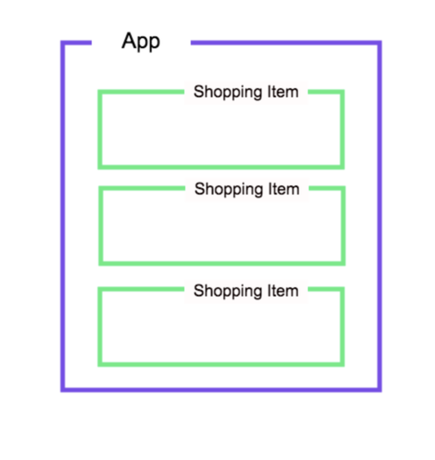

# Multiple Components and Props

**Lesson Duration: 60mins**

### Learning Objectives
- Understand how to register components
- Understand how to pass data down as props

## Intro

We've seen how to make Vue components. Next, we're going to see how to make components that we can re-use, for example, in a list.

Doing so means that we can add individual functionality and styling, and it makes our code more maintainable.

## Shopping List

We're going to go back to the shopping list app that we made earlier in the week, but this time, we'll create a reusable component for each item.

Lets have a look at what the component structure is going to look like.



`App` is our entry component, the component that is rendered into the `#app` element on the DOM. `App` is where all of our shopping list items will live in state.  For each element within the shopping list we'll render a `ShoppingListItem` component.

```bash
vue create shopping-list
```

We'll start off by stripping out the boilerplate code of `App.vue` and then creating our own component scaffolding with Atom's `language-vue` package.

Let's also give our page a header.

```html
<!-- App.vue -->
<template lang="html">
  <h1>My Shopping List</h1>
</template>

<script>
export default {
}
</script>

<style lang="css" scoped>
</style>
```

And then let's give the component a name, and some data.

```html
<!-- AS BEFORE -->
<script>
export default {
  name: 'app',
  data() { //NEW
    return {
      items: [
        {name: 'Milk', isPurchased: false},
        {name: 'Cheese', isPurchased: true},
        {name: 'Beans', isPurchased: false},
      ]
    };
  }
}
</script>
```

### Registering Components

We're going to render a list of shopping list items.  But instead of rendering them as `<li>` elements, we're going to render a shopping list item component.

First off, we'll make that file. Open a new terminal tab so that our app keeps running.

```bash
touch src/components/ShoppingListItem.vue
```

In here, for the time being, let's just generate our scaffolding and within the template render a `<p>` tag to indicate this is a `shopping list item component`.

```html
<!-- ShoppingListItem.vue -->
<template lang="html">
  <p>Shopping list item component</p>
</template>

<script>
export default {
  name: 'shopping-list-item'
}
</script>

<style lang="css" scoped>
</style>
```

Next, we're going to import this component where we need to use it.

### Using our custom component

Next, we're going to import our `ShoppingListItem` within the `App` component.  We also need to register it under the `components` key. Then we can render it within the template. As we're now rendering more than one element within the template we have to wrap these elements in a root element - in this instance a `div`. Templates can only render one root element, without the `div` we would have had two root elements.

```html
<!-- App.vue -->
<template lang="html">
  <div class=""> <!-- NEW -->
    <h1>My Shopping List</h1>
    <shopping-list-item></shopping-list-item>  <!-- NEW -->
  </div>
</template>

<script>
import ShoppingListItem from './components/ShoppingListItem.vue'; //NEW

export default {
  name: 'app',
  data() {
    return {
      items: [
        {name: 'Milk', isPurchased: false},
        {name: 'Cheese', isPurchased: true},
        {name: 'Beans', isPurchased: false},
      ]
    };
  },
  components: {  //NEW
    'shopping-list-item': ShoppingListItem
  }
}
</script>
```

You should see a `shopping-list-item` component being shown to the user in your browser.

### Component Naming Convention

[Vue's Style Guide](https://vuejs.org/v2/style-guide/) recommendeds that component names should be multi-word, except for root App components.  This prevents conflicts with existing and future HTML elements, since all HTML elements are a single word.

The component name can be either be `kebab-case`, `camelCase` or `PascalCase`. So `list-item`, `listItem` or `ListItem`.  We'll stick to `kebab-case` as it looks more `html tag` like and we'll be rendering these components within our html templates.

## Passing Props

As it stands, we're just rendering one `list-item` component that has no relation to the data. Let's fix that.

Let's use a `v-for` directive to render a `list-item` component for each item in our data object.

```html
<!-- App.vue -->
<template lang="html">
  <div>
    <h1>My Shopping List</h1>
    <ul>
      <shopping-list-item v-for="(item, index) in items" :key="index"></shopping-list-item>  <!-- MODIFIED -->
    </ul>
  </div>
</template>
```
When we render list items in Vue we have to give each element a `key` which we can `bind` to the item.  This is to ensure that whenever an element of the list is changed the document will only re-render this item and not the whole list. Vue requires this attribute, and will throw a warning when it is not found.

Navigate to the browser and you should see three `shopping-list-item` components.

Now we want each of these `shopping-list-item` components to correlate with each item.  How do we do this?  By passing properties or `props` to the component.

`Props` are custom attributes you can register on a component. When a value is passed to a prop attribute, it becomes a property on that component instance.

Let's give each `shopping-list-item` a prop of `item` and bind that prop to the iteration of the item in the loop.

```html
<!-- App.vue -->
<template lang="html">
  <div>
    <h1>My Shopping List</h1>
    <ul>
      <shopping-list-item v-for="item in items" :key="index" :item="item"></shopping-list-item> <!-- MODIFIED -->
    </ul>
  </div>
</template>
```

We now have access to that item in our `shopping-list-item` component.  Let's update this component so that we now render `item.name` instead of our placeholder component message.

```html
<!-- ShoppingListItem.vue -->
<template lang="html">
  <li>{{ item.name }}</li> <!-- MODIFIED -->
</template>
```
If we refresh the browser we see nothing.  And we now have an error message in the console saying `cannot read property 'name' of undefined`.

We've passed the prop down, but we still need to give the component a list of props it accepts.  We can do this using the `props` key. Since we're binding with `:item` in the component above, we need to use `item` here.

```html
<!-- ShoppingListItem.vue -->

<!-- AS BEFORE -->
<script>
export default {
  name: 'shopping-list-item',
  props: ['item'] //NEW
}
</script>
```

Great, in the browser we can now see our shopping list items rendering.

## Styling Components

As it stands our shopping list doesn't do too much. Let's change that, by displaying items that have been purchased in a different manner than those that haven't. One of the benefits of using `.Vue` files is that we can confine styling to our individual components, and see how a component is structured, how it behaves, _and_ how it looks - all in the same file!

Let's start by creating some styling for our purchased and unpurchased items:

```html
<!-- ShoppingListItem.vue -->
<style lang="css" scoped>

.not-purchased {
  background-color: lightgoldenrodyellow;
}

.purchased {
  text-decoration: line-through;
  background-color: red;
}
</style>
```

So if an item is unpurchased, we set the background colour of the `<li>` tag to `lightgoldenrodyellow`, and if an item has been purchased we want the background colour to be `red` with the text scored out. Previously when we made a shopping list we bound the class to a ternary operator that gave us a class name - but now we know a better way of abstracting our logic out of our views to help make our html more readable: `computed properties`!

### Task: 5 minutes

Use a computed property to provide the correct class for a purchased or unpurchased item.

### Solution

Let's set up the computed property first. Since we're only expecting two outcomes here - wether our item `isPurchased` or not, it makes sense to use a ternary operator.

```html
<!-- ShoppingListItem.vue -->
<script>
export default {
  name: 'shopping-list-item',
  props: ['item'],
  computed: {  //NEW
    purchasedClass: function(){
      return this.item.isPurchased ? "purchased" : "not-purchased";
    }
  }
}
</script>
```

If we wanted to check that this was working at this point, we could use our devTools to inspect each individual `shopping-list-item` and look and see what the value of `purchasedClass` is under the `computed` section.

All that remains then is to use the return value of this computed property as the class of our `li` element - remember, as this is a dynamic Vue variable, we need to `bind` it, to avoid the value we use being parsed as a string by Vue:

```html
<!-- ShoppingListItem.vue -->
<template lang="html">
    <li :class="purchasedClass">{{ item.name }}</li>
</template>
```

This syntax means that the presence of the `.purchased` or `.not-purchased` class depends on the truthiness of `item.isPurchased`.

If you navigate back to the browser you should now see this style change.  

## Recap

How do we make a component accessible to a parent component?
<details>
<summary>Answer:</summary>

We import it within the parent component and then register it in the parent component's `component` object.

</details>
<br />

How do we pass data down from a parent component to a child component?
<details>
<summary>Answer:</summary>

Via `props` - custom attributes that we can add to our components when we create them in our parent components' html, and register within the child components, allowing access to the data being passed down.

</details>
<br />

## Conclusion

We've seen how to build our own Vue components, which will allow us to separate the concerns of our app's functionality and make our code more maintainable. `.vue` files also allow us to have sight of a component's HTML, CSS and JavaScript all in the same file, allowing for simpler organisation of our code. Best of all, the concept of components means that we have code that can be reusable.
