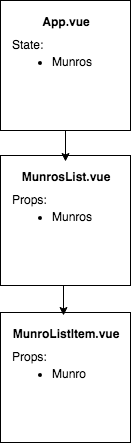
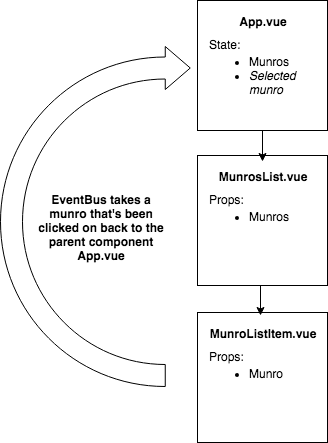
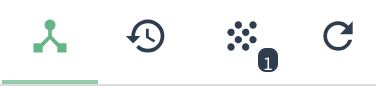
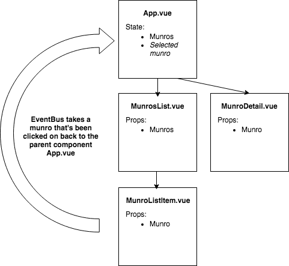

# Multiple Components and Event Bus

**Lesson Duration: 90mins**

### Learning Objectives
- Understand how to pass data between components

##  Intro

We've seen how to pass data down to child components. But how do we pass data back up, or to another component? One solution is an `EventBus`.

An `EventBus` allows us to emit an event in one component and listen for that event in another. In computer science terminology a **bus** is the shared medium by which data is transfer from one place to another. This can be physical - actual circuits on a computer motherboard. For the `EventBus` it is purely software.

One way to think about this is like radio. Someone broadcasts on a specific frequency and anyone listening on that frequency will pick up the broadcast.

In the context of `EventBus` one component will broadcast data using an event name and any component listening using *the same event name* can pick up the data. Much the same as a button broadcasts a `click` event that we can add an event listener to.

### Task: 10 minutes

Open the start code.

```bash
npm install
npm run serve
```

Read though the code and identify how the data is flowing throughout the application - for instance, where is the Munro data coming from? Where does that data then go, in terms of components and how does it get where it's going?

<details>
<summary>Answer</summary>

- On mount, `App.vue` makes a `fetch` request to the Munros API and sets the result of that to be the `munros` data field.
- The Munros data is passed down to the `munros-list` component as `props`. This is a `ul` and for each `munro` in the array of `munros` that have been passed down as props a `list-item` component is rendered.
- The `list-item` has `props` of `munro`.  This component is rendering the Munro's name as an `li`
</details>

At present our application could be diagrammed like this:



**What are we building?**

All we have is a list of names of Munros (a Munro is a Scottish mountain that is over 3000ft high). But if we look at the [API](https://munroapi.herokuapp.com/munros) you can see that it gives us a lot more information.

We want to be able to click on a list item and have details of that Munro render on screen. To do this we'll use the `eventBus` to transmit the data from one component to another.

This plan could be diagrammed like this:



## Creating the EventBus

Our `eventBus` is going to be a new Vue instance. We'll register it in `main.js` as a local variable and export it as a *named [export](https://developer.mozilla.org/en-US/docs/web/javascript/reference/statements/export)*. Exporting the variable in this way allows it to be *imported* into other modules (files). It also avoids other undesirable ways of sharing state such as global variables.


```js
// main.js
import Vue from 'vue';
import App from './App.vue';

export const eventBus = new Vue(); //NEW

new Vue({
  el: "#app",
  render: h => h(App)
});
```

### Why are we making a new Vue instance?

A Vue instance comes with some out the box methods and properties. We've already seen some of these:
- `data` and `props` and instance properties
- lifecycle methods are instance methods

We also use the instance methods `on` and `emit`, and we'll look at these shortly.

The Vue instance gives us a Vue object which is entirely decoupled from the DOM. All that exists on it are the instance methods.

## Using the EventBus in Components

To use the `eventBus` throughout the app we'll have to import it into each component that requires it.

The first place that we'll import it into is the `ListItem` component. When we click on an item, we want to `emit` to the rest of the app the item which has been clicked on.

```js
// ListItem.vue
<script>
import { eventBus } from '../main.js' //NEW

export default {
  name: 'list-item',
  props: ['munro']
}
</script>
```

The `import {thing}` syntax indicates that we're importing an object which isn't the _default_ export from that file.

Next, let's set up the click event on our list element. When we click an item we want to call a `handleClick` function. Within this function, let's log out the munro that this element has access to via props.

```js
//ListItem.vue
<template lang="html">
  <li v-on:click="handleClick">{{munro.name}}</li> //MODIFIED
</template>

<script>
import { eventBus } from '../main.js'

export default {
  name: 'list-item',
  props: ['munro'],
  methods: { //NEW
    handleClick(){
      console.log('munro', this.munro);
    }
  }
}
</script>
```

Navigate to the browser and click on a list item, and you should see an object being logged out that has all the details of that Munro.

Now we know we have access to the Munro when we click on the list item. Next, we want to `emit` that Munro to the rest of the app. We want to board this Munro data onto the `eventBus`.

```js
// ListItem.vue
<script>
import { eventBus } from '../main.js'

export default {
  name: 'list-item',
  props: ['munro'],
  methods: {
    handleClick(){
      eventBus.$emit('munro-selected', this.munro) //MODIFIED
    }
  }
}
</script>
```

Here we're calling the `$emit` instance method on our `eventBus`. The `$` indicates that it is a Vue instance method.

The first argument is the name of the event that we're emitting, as a string. You can call this event anything you like. We'll need to re-use it when we want to listen out for this event.

The second argument is the object that we're emitting (in this case, the details of the Munro that we're interested in).

Navigate back to your browser and click on an item again. In your Vue dev tools you should see an events icon.



Click on this to switch to `events view`.

In here you can see the name of our event - `munro-selected` and if we click on that, within that event's `payload` you should see the `munro` object.

We now have access to this data wherever in our app we decide to listen out for it.

## Listening for the Event

Within `App.vue` we can see that we have a data value of `selectedMunro` which is initially set as `null`. We want to set that value to be the data of the list item we've clicked on.

Let's start off by importing the `eventBus` into this component.

```js
//App.vue
<script>
import { eventBus } from './main.js'; //NEW
import MunrosList from './components/MunrosList.vue';

// AS BEFORE
</script>

```

We're now going to listen out for the data that has been emitted from `ListItem`. We'll do this within the `mounted` function.

```js
//App.vue
<script>
import { eventBus } from './main.js';
import MunrosList from './components/MunrosList.vue';

export default {
  name: 'app',
  data(){
    return {
      munros: [],
      selectedMunro: null
    };
  },
  mounted(){
    fetch('https://munroapi.herokuapp.com/munros')
    .then(res => res.json())
    .then(munros => this.munros = munros)

    eventBus.$on('munro-selected', (munro) => { //NEW
      console.log('within $on', munro);
    })
  },
  components: {
    "munros-list": MunrosList
  }
}
</script>
```

Here we're calling `$on` on the `eventBus` instance.  

This method takes two arguments:

- The name of the event we're listening out for (which we designated `'munro-selected'` earlier)
- A callback, which takes the payload that was emitted as an argument

Let's log out this munro to check it is the same payload that is being emitted. This is good practice to ensure you know what data you are working with.

Now we're happy that we're receiving the correct information, let's assign it to our `selectedMunro` data value.

```js
//App.vue

//AS BEFORE
mounted(){
  fetch('https://munroapi.herokuapp.com/munros')
  .then(res => res.json())
  .then(munros => this.munros = munros)

  eventBus.$on('munro-selected', (munro) => {
    this.selectedMunro = munro //MODIFIED
  })
}
```

Navigate to the browser and click on a munro in the list.  Then within your dev tools change back to component view and select the `App` component. You should in here that `selectedMunro` has changed from `null` to our munro object.

We've now successfully managed to pass data from one component to another. From here we can use this data to render details about the selected munro.

## Rendering Munro Detail

Let's make a new component which is responsible for rendering the Munro detail. Our final product will look something like this:



```bash
touch src/components/MunroDetail.vue
```

Let's start off with our component scaffolding.

```js
//MunroDetail.vue
<template lang="html">
  <p>I am the munro detail component</p>
</template>

<script>
export default {
  name: 'munro-detail'
}
</script>

<style lang="css" scoped>
</style>

```
Now we need to think about where we want to register this component. Where do we want it to be rendered? We'll do it within the app component as it wouldn't make any sense to render it anywhere within the list.

Lets import the component and then register it.

```html
// App.vue
<script>
import { eventBus } from './main.js';
import MunrosList from './components/MunrosList.vue';
import MunroDetail from './components/MunroDetail.vue'; //NEW

export default {
  name: 'app',
  data(){
    return {
      munros: [],
      selectedMunro: null
    };
  },
  mounted(){
    fetch('https://munroapi.herokuapp.com/munros')
    .then(res => res.json())
    .then(munros => this.munros = munros)

    eventBus.$on('munro-selected', (munro) => {
      this.selectedMunro = munro
    })
  },
  components: {
    "munros-list": MunrosList,
    "munro-detail": MunroDetail //NEW
  }
}
</script>
```

And then render it next to the `munros-list`.

```js
//App.vue
<template>
  <div class="">
    <h1>Munros</h1>
    <div class="main-container">
      <munros-list :munros='munros'></munros-list>
      <munro-detail></munro-detail> //NEW
    </div>
  </div>
</template>

```

Great, now in the browser you should see `I am the munro detail component` rendering next to the list. But we don't want this, we want the details about the munro we've selected.

We want to pass details of the `selectedMunro` down to the `munro-detail` component. How do we pass data from a parent component to a child? `props`!

```html
//App.vue
<template>
  <div class="">
    <h1>Munros</h1>
    <div class="main-container">
      <munros-list :munros='munros'></munros-list>
      <munro-detail :munro='selectedMunro'></munro-detail> //MODIFIED
    </div>
  </div>
</template>

```

Here we're creating a prop called munro and binding it to the selectedMunro data value of App.vue.

We now need to register this prop in `munro-detail`.

```js
//MunroDetail.vue
<script>
export default {
  name: 'munro-detail',
  props: ['munro'] //NEW
}
</script>
```

If we look in the dev tools, when a munro has been selected you should see the `MunroDetail` component's prop of `munro` is set as the `selectedMunro`.

The last thing we have to do is use this data to render details about the Munro.  

```html
//MunroDetail.vue
<template>
  <div> //MODIFIED
    <h3>{{munro.name}}</h3>
    <p>Height: {{munro.height}}</p>
    <p>Region: {{munro.region}}</p>
    <p>Meaning: {{munro.meaning}}</p>
  </div>
</template>
```

Navigate back to the browser and refresh the page. The list no longer renders and there's an error in the browser.

```
cannot read property name of null
```

We have an issue. The `selectedMunro` starts off as `null` and isn't populated until we click on a list item. However, this error is preventing the app from rendering so we can't click on an item to set the selectedMunro.

To fix this we need to only render the `div` containing the Munro details if there is a Munro to render. i.e `selectedMunro` is not `null`.

We can do this with an if statement on the div.

```html
//MunroDetail.vue
<div v-if='munro'> //MODIFIED
  <h3>{{munro.name}}</h3>
  <p>Height: {{munro.height}}</p>
  <p>Region: {{munro.region}}</p>
  <p>Meaning: {{munro.meaning}}</p>
</div>
```

Sorted! Now our page renders and when we click on a munro its details render.

## Recap

What does an `EventBus` allow us to do?
<details>
<summary>Answer:</summary>

It allows us to pass data from one component to another. While we'll continue passing down data from parent to child component via `props`, an `eventBus` allows us to send data back from child to parent, or conceivably from any component to another.
</details>
<br />

What kind of object is an `eventBus`?
<details>
<summary>Answer:</summary>

An `eventBus` is a *separate Vue instance*, decoupled from our main app. We export it from our `main.js` file and import it into other components where necessary.

</details>
<br />
What methods do we use on our `eventBus`?
<details>
<summary>Answer:</summary>
`$emit` to send data, and `$on` to recieve it in another component.

</details>

## Conclusion

With `eventBus`, we now know how to pass data from child to parent component, allowing us to continue separating the concerns of our components and working towards maintainable, reusable code.
