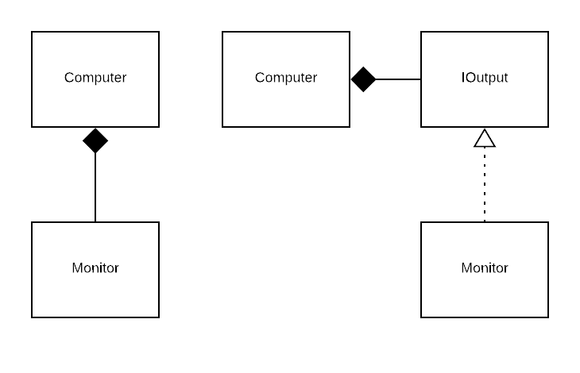

# Composition

## Objectives


  - Understand what composition is
  - Understand how inheritance can sometimes lead us into dead-ends
  - How we can use *composition over inheritance* to resolve these
  - Understand how to compose objects using interfaces


## Intro

## IS-A vs HAS-A


  -  When we think about inheritence and how we can use it to construct our program we are usually concerned with what a thing IS. An Adult IS A Person.

  -  When we think about composition we are concerned with what an thing HAS. So a Car HAS AN Engine, as opposed to a Car being a Vehicle.


In terms of the behaviour of a Car we can consider what it HAS to carry about that behaviour - an Engine. Not what it IS gives us that behaviour (for example a drive() method from a Vehicle superclass).

We compose objects from other objects in order to get us to the functionality we need. And we’ve been doing this for a while without outright calling it Composition…we’ve had Hotels composed of Rooms.

So we’re going to look at an example where our inheritance is starting to weigh us down and we can’t get the behaviour we need without breaking our hierarchy or making things ugly. And how we can use *composition over inheritance* to solve this problem.

We’re also going to use interfaces to help us with this solution.

>
>   Give out starter code.


Get the students to read it for 45 mins to an hour.

The students should:

  - draw a diagram of the classes and how they are related.


## The problem

Key point:

We want the wizard to fly a dragon. Or a magic carpet. Or anything that flies and he feels confident climbing on.


  - Pair up and discuss it


Possible solutions:

  - Common superclass for flying types? Nope, already existing class heirarchy so it doesn’t make sense.

  - Ancestor for all objects? We don’t want everything to fly!

  - Multiple inheritance? It’s not supported and there’s all sorts of issues. If two superclasses have the same method, which does it use?


We want a common set of abilities that our things can do without polluting their class hierarchy which things that don’t concern it.

More than that, we don’t want this magical thing to have any clue about that behaviour, just to make sure that it exists on our object. A dragon NEEDS to fly, a magic carpet NEEDS to fly but we don’t want our structure to care HOW they fly.

## Interfaces to the rescue

To solve our problem we are going to


  - Add a IFlyable interface

  - Dragon, Magic Carpet, Broomstick all implement it

  - Change to IFlyable in the wizard


First things first, let’s add the IFlyable interface.

```bash
#intelliJ

>right click on java folder and select
New > package >Call the new package behaviours

> Right click behaviours folder and create a IFlyable interface
```

``` java
//IFlyable.java
package behaviours;

public interface IFlyable {
  String fly();
}
```


Now, we need to make our Dragon and Broomstick implement it.

``` java
//Dragon.java

public class Dragon extends MythicalBeast implements IFlyable { /* UPDATED */ }
```
```
//Broomstick.java
package wizard_management;

public class Broomstick extends CleaningImplement implements IFlyable { /*UPDATED */ }
```
You will notice that intelliJ automatically imports the IFlyable interface from the behaviours package for us.
If it doesn’t then type the following above the class declaration:

```bash
import behaviours.IFlyable//NEW
```

We already have tests to see if these things fly, so if we run them they should all still pass.

Let’s now add the test for flying the Dragon.

``` java
//WizardTest.java

@Test
public void canFlyDragon(){
  Dragon dragon = new Dragon("Tilly");
  wizard = new Wizard("Toby", dragon);
  assertEquals("Standing up tall, beating wings, lift off!", wizard.fly());
}

```

If we build this, we will see an error “Incompatible types: Dragon cannot be converted to Broomstick”. This is quite correct, a Dragon and Broomstick are completely unrelated and we are passing a Dragon to a method which is expecting a Broomstick. We need to change this to be IFlyable in the method signature.

```java
package wizard_management.people;
import wizard_management.behaviours.*; //NEW

public class Wizard {
  String name;
  private IFlyable ride; //UPDATED

  public Wizard(String name, IFlyable ride){ //UPDATED
    this.name = name;
    this.ride = ride; //UPDATED
  }

  public String getName(){
    return this.name;
  }

  public IFlyable getRide(){ //UPDATED
    return this.ride;
  }

  public String fly(){
    return this.ride.fly(); //UPDATED
  }

}
```

Since we have changed the name of getBroomstick, we need to go update our test. We’ll need to use our new casting powers we gained yesterday!

```java
//WizardTest.java

@Test
public void hasBroomstick(){
  Broomstick ride = (Broomstick) wizard.getRide();
  assertEquals("Nimbus", ride.getBrand());
}
```

Whoot! We have successfully ridden a dragon. Let’s see if he can fly a magic carpet.

```java
//WizardTest.java

@Test
public void canFlyMagicCarpet(){
  MagicCarpet carpet = new MagicCarpet("Purple");
  wizard = new Wizard("Toby", carpet);
  assertEquals("Hovering up, straightening out, flying off!", wizard.fly());
}
```

This fails, since MagicCarpet is not IFlyable. Let’s go fix that!

```java
//MagicCarpet.java
package wizard_management;
import wizard_management.behaviours.*; //NEW

public class MagicCarpet extends Carpet implements IFlyable { /*UPDATED */ }
```

## Strategy Pattern

Wouldn’t it be nice if we could set the ride on the wizard? Then on the same instance of a wizard we could swap out the broomstick for a dragon and vice versa. We are no longer tied to one ride for the life of the wizard object.

```java
//WizardTest
@Test
public void canSetRide(){
  Dragon dragon = new Dragon("Erik");
  wizard.setRide(dragon);
  assertEquals("Standing up tall, beating wings, lift off!", wizard.fly());
}
```

This is a fairly easy change.

```java
//Wizard.java
public void setRide(IFlyable ride){
  this.ride = ride;
}
```

This ability to set the behaviour of the wizard’s fly method (using `setRide`) is an example of an architectural pattern. In this case, it’s the Strategy Pattern. That is, we know our wizard can `fly` and by setting the `IFlyable` object that they ride, we can change the ‘strategy’ they use to do so.

e.g. `save` method, with `Storage` interface, so can either `save` to cloud or to hard drive, by using a `setStorage` method.

## Dependency Inversion

“High-level modules should not depend on low-level modules. Both should depend on abstractions.”



Originally our high-level module **Computer** depended on the low level module **Monitor**. Low-level as in a specific (concrete) implementation (sometimes called the detail).

We can instead use an **IOutput** interface (abstraction) so our **Computer** and our **Monitor** depend on an abstraction. Low-level modules can implement our abstraction. And our high-level component depends on the abstraction to know it can use any implementation. Making our code extendable. (Also following Open / Closed principle)

>
>   Instructors: Write up Dependance Inversion under SOLID headings on board.


# Recap


  - Composition refers to a **HAS-A** relationship where an object is made up of one or more other objects.

  - When we are using inheritance we tend to think of what an object is - how it relates to other objects in a **IS-A** relationship. A Square **IS A** Shape.

  - Composition allows a class to use behaviour from a group of other classes, and makes it possible for that behaviour to change at runtime. We we swap behaviours in and out in like this at runtime we call this the Strategy Pattern.
